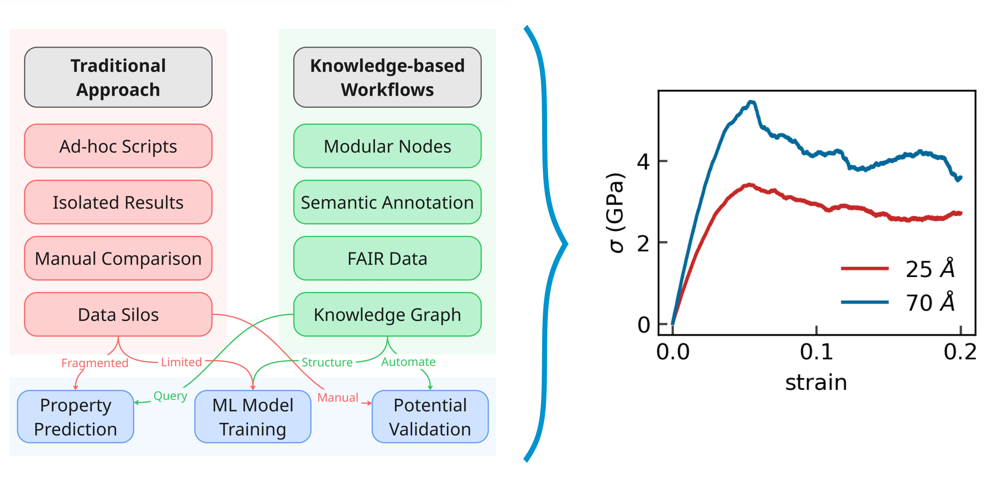

### Knowledge-based workflows of mechanical behavior with atomistic simulations

Modular workflows for mechanical and thermodynamic properties of body-centered cubic iron as an example, covering tasks such as equation of state, elastic tensors, mechanical loading, defect energetics, and nanoindentation. Each workflow is implemented using pyiron workflow nodes that automatically generate semantic metadata aligned with the CMSO and ASMO ontologies, ensuring a consistent and machine-readable description of the computational sample, modelling method, and provenance.

Users can run atomistic simulations using the LAMMPS molecular dynamics software, with examples provided for embedded-atom method (EAM) potentials. The demonstrator also allows users to inspect the conceptual dictionary associated with each workflow, which captures workflow inputs, outputs, and semantic annotations. This interactive setup provides a lightweight environment for exploring how knowledge-based workflows are constructed, executed, and semantically enriched, without requiring local installation or configuration of simulation tools.

You can run and explore the workflows directly in your browser using Binder: https://mybinder.org/v2/gh/pyscal/semantic-workflows/HEAD

##### Highlights
- pyiron, joblow: used as a workflow manager
- atomRDF: Automated semantic annotation of atomistic simulation outputs.
- ASMO and CMSO: Standardized ontology framework for atomistic simulation and computational 




## Setup

### Environment Setup

Create a conda environment using the provided environment file:

```bash
conda env create -f environment.yml
conda activate workflow-rdf
```

### Python Path Configuration

If you need to import the workflows module from outside this directory, add the repository to your PYTHONPATH:

```bash
# Temporary (current session only)
export PYTHONPATH="/path/to/semantic-workflows:$PYTHONPATH"

# Permanent (add to ~/.bashrc or ~/.zshrc)
echo 'export PYTHONPATH="/path/to/semantic-workflows:$PYTHONPATH"' >> ~/.bashrc
```

## Property calculation workflows

The workflows can be used in three different ways:

### Pyiron Workflow 

```python
from workflows.pyiron.build import bulk
from workflows.pyiron.evcurves import calculate_ev_curves
from pyiron_workflow import Workflow
from conceptual_dictionary import ConceptualDict

# Initialize conceptual dict
cd = ConceptualDict()

# Create workflow
wf = Workflow('ev_demo')

# Build structure with cdict tracking
wf.structure = bulk('Fe', crystalstructure='bcc', a=2.87, cubic=True, cdict=cd)

# Calculate EV curves with cdict tracking
wf.ev_curves = calculate_ev_curves(
    wf.structure,
    pair_style="eam/alloy",
    pair_coeff="* * workflows/potentials/Fe_Ack.eam Fe",
    vol_range=0.01,
    num_of_points=5,
    cores=1,
    cdict=cd,
)

# Execute workflow
results = wf.run()

# Export conceptual dict
cd.to_yaml('workflow_metadata.yaml')
```

### Jobflow 

```python
from workflows.jobflow.build import bulk
from workflows.jobflow.evcurves import calculate_ev_curves
from jobflow import Flow, run_locally
from conceptual_dictionary import ConceptualDict

# Initialize conceptual dict
cd = ConceptualDict()

# Create structure job
structure_job = bulk('Fe', crystalstructure='bcc', a=2.87, cubic=True, cdict=cd)

# Create EV curves job (depends on structure job)
ev_job = calculate_ev_curves(
    structure_job.output,  # Use output from previous job
    pair_style="eam/alloy",
    pair_coeff="* * workflows/potentials/Fe_Ack.eam Fe",
    vol_range=0.01,
    num_of_points=5,
    cores=1,
    cdict=cd,
)

# Create flow
flow = Flow([structure_job, ev_job], name='ev_demo_flow')

# Run flow locally (or submit to HPC scheduler)
results = run_locally(flow)

# Export conceptual dict
cd.to_yaml('workflow_metadata.yaml')
```

### Direct Python

We can also run workflows directly using core Python functions without any framework decorators. This is useful for simple scripts, testing, or when you don't need workflow management.

```python
from workflows.evcurves import calculate_ev_curves
from workflows.build import bulk
from conceptual_dictionary import ConceptualDict

# Initialize conceptual dict
cd = ConceptualDict()

# Create structure
structure = bulk('Fe', crystalstructure='bcc', a=2.87, cubic=True, cdict=cd)

# Calculate EV curves
results = calculate_ev_curves(
    structure,
    pair_style="eam/alloy",
    pair_coeff="* * workflows/potentials/Fe_Ack.eam Fe",
    vol_range=0.01,
    num_of_points=5,
    cores=1,
    cdict=cd,
)

# Export conceptual dict
cd.to_yaml('workflow_metadata.yaml')
```

## Export to knowledge graph

```python
from atomrdf import WorkflowParser, KnowledgeGraph

kg = KnowledgeGraph()
wf = WorkflowParser(kg)
wf.parse("workflow_metadata.yaml")
```

## Run SPARQL queries

### Programatically using [tools4RDF](https://tools4rdf.readthedocs.io/en/latest/)

Find all the samples, and calculated Bulk Modulus:

```python
kg.query(kg.ontology.terms.cmso.AtomicScaleSample,
         kg.ontology.terms.asmo.BulkModulus)
```

### Direct SPARQL

```python
kg.graph.query(
    """
    PREFIX rdf: <http://www.w3.org/1999/02/22-rdf-syntax-ns#>
    PREFIX asmo: <http://purls.helmholtz-metadaten.de/asmo/>
    PREFIX cmso: <http://purls.helmholtz-metadaten.de/cmso/>
    SELECT DISTINCT ?AtomicScaleSample ?BulkModulus
    WHERE {
        ?AtomicScaleSample asmo:hasCalculatedProperty ?BulkModulus .
        ?AtomicScaleSample rdf:type cmso:AtomicScaleSample . 
        ?BulkModulus rdf:type asmo:BulkModulus . 
    }
    """
)
```
